# JA4 Nginx Module: Technical White Paper

## 1. Introduction

This document provides a comprehensive technical analysis of the `ja4-nginx-module`, a security fingerprinting solution that operates at the intersection of network protocols and application security. 

**What is JA4?** JA4 is a TLS client fingerprinting method that creates unique signatures based on how applications establish encrypted connections. Unlike simple User-Agent strings, JA4 signatures are difficult to spoof and reveal the true identity of the connecting client.

**Purpose of This Module**: The `ja4-nginx-module` integrates JA4 fingerprinting directly into Nginx, enabling real-time detection and blocking of malicious clients, bots, and security tools attempting to intercept traffic.

**What You'll Learn**:
1. **Network Fundamentals**: OSI Model, TCP connections, and TLS handshakes explained from the ground up
2. **Intervention Points**: Exactly where and how this module intercepts connection data at Layers 4, 6, and 7
3. **Algorithms**: Complete breakdown of JA4TCP, JA4, JA4H, and JA4ONE calculation methods
4. **Practical Examples**: Step-by-step walkthrough with real hex values and packet captures

---

## 2. Network Fundamentals

To understand how the JA4 module operates, we must first understand the networking stack it interacts with.

### 2.1 The OSI Model

The **OSI (Open Systems Interconnection) Model** is a 7-layer framework describing how data travels from an application on one computer to an application on another.

| Layer | Name | Function | Examples | JA4 Module Interaction |
|-------|------|----------|----------|------------------------|
| **7** | Application | User-facing protocols | HTTP, DNS, SSH | ✅ Analyzes HTTP headers (JA4H) |
| **6** | Presentation | Data formatting, encryption | SSL/TLS, JPEG, ASCII | ✅ **CRITICAL: Intercepts TLS handshake** |
| **5** | Session | Connection management | NetBIOS, RPC | ✅ Where TLS session is established |
| **4** | Transport | End-to-end delivery | TCP, UDP | ✅ **NEW: Captures TCP SYN packet (JA4TCP)** |
| **3** | Network | Routing between networks | IP, ICMP | ❌ Not used |
| **2** | Data Link | Node-to-node transfer | Ethernet, MAC | ❌ Not used |
| **1** | Physical | Hardware transmission | Cables, radio waves | ❌ Not used |

**Key Insight**: The JA4 module now operates at **Layers 4-7**, capturing TCP SYN data (Layer 4), TLS handshake data (Layer 6), and HTTP headers (Layer 7) for comprehensive client fingerprinting.

### 2.2 TCP Connection Establishment

Before any TLS handshake can occur, a reliable TCP connection must be established using the **3-Way Handshake**.

```mermaid
sequenceDiagram
    participant Client
    participant Server
    
    Note over Client,Server: TCP 3-Way Handshake
    Client->>Server: SYN (Seq=100)
    Note right of Server: Server receives connection request
    Server->>Client: SYN-ACK (Seq=300, Ack=101)
    Note left of Client: Client confirms server is ready
    Client->>Server: ACK (Seq=101, Ack=301)
    Note over Client,Server: ✅ Connection ESTABLISHED
    
    Note over Client,Server: Now TLS Handshake can begin...
```



**Explanation**:
1. **SYN (Synchronize)**: Client sends a packet with a random sequence number (e.g., 100) to initiate connection
2. **SYN-ACK**: Server responds with its own sequence number (300) and acknowledges the client's (101 = 100+1)
3. **ACK (Acknowledge)**: Client confirms by acknowledging the server's sequence number (301 = 300+1)

**JA4 Module Action**: At this point, Nginx accepts the connection. The module observes the socket state to determine if the connection is TCP or QUIC (for the `t`/`q` flag in the fingerprint).

### 2.3 The TLS Handshake - Complete Lifecycle

Once the TCP connection is established, the **TLS (Transport Layer Security) Handshake** begins. This is where encryption parameters are negotiated.

#### TLS 1.3 Handshake Flow

```mermaid
sequenceDiagram
    participant C as Client
    participant N as Nginx + JA4 Module
    
    Note over C,N: TLS 1.3 Handshake
    C->>N: ① ClientHello
    Note over N: 🔴 INTERVENTION POINT #1<br/>Module captures raw data here
    N->>C: ② ServerHello + Certificate + Finished
    C->>N: ③ Finished
    Note over C,N: ✅ Encrypted Channel Ready
    
    C->>N: ④ HTTP Request (GET /)
    Note over N: 🔴 INTERVENTION POINT #2<br/>Module enforces rules here
    N->>C: ⑤ HTTP Response
```



**Critical Stages**:
1. **ClientHello** ← **JA4 MODULE CAPTURES DATA HERE**
2. **ServerHello**: Server responds with chosen cipher and certificate
3. **Finished**: Both sides confirm encryption is ready
4. **Application Data**: HTTP traffic begins ← **JA4 MODULE ENFORCES RULES HERE**

---

## 3. ClientHello Message - The Foundation of JA4

The **ClientHello** is the first message sent by a client during the TLS handshake. It contains all the information needed to create a JA4 fingerprint.

### 3.1 Browser Connection Flow (Complete Step-by-Step)

Before examining the ClientHello structure in detail, let's understand the complete flow when a browser navigates to `https://example.com`:


**Key Point**: The ClientHello is sent **unencrypted** (in standard TLS), so any middlebox (including the JA4 module) can inspect it.

### 3.2 ClientHello Byte-Level Structure

The ClientHello is a precisely formatted binary message. Here's the complete structure:

#### Complete Structure Table

| Field | Offset | Size | Example Value | Description |
|-------|--------|------|---------------|-------------|
| **Record Layer Header** | | | |
| Content Type | 0 | 1 byte | `0x16` | Handshake protocol |
| TLS Version | 1-2 | 2 bytes | `0x0303` | Legacy TLS 1.2 (for compatibility) |
| Record Length | 3-4 | 2 bytes | `0x00c6` | Length of handshake message (198 bytes) |
| **Handshake Protocol** | | | |
| Handshake Type | 5 | 1 byte | `0x01` | ClientHello (1) |
| Handshake Length | 6-8 | 3 bytes | `0x0000c2` | Length of ClientHello (194 bytes) |
| **ClientHello Message** | | | |
| Client Version | 9-10 | 2 bytes | `0x0303` | TLS 1.2 (again, legacy field) |
| Random | 11-42 | 32 bytes | `5f1a2b3c...` | Cryptographically random bytes |
| Session ID Length | 43 | 1 byte | `0x20` | 32 bytes |
| Session ID | 44-75 | Variable | `a1b2c3d4...` | For session resumption |
| Cipher Suites Length | 76-77 | 2 bytes | `0x0020` | 32 bytes (16 cipher suites) |
| Cipher Suites | 78-109 | Variable | `0x1301 0x1302...` | List of supported ciphers |
| Compression Length | 110 | 1 byte | `0x01` | 1 compression method |
| Compression Methods | 111 | Variable | `0x00` | None (null compression) |
| Extensions Length | 112-113 | 2bytes | `0x0050` | 80 bytes of extensions |
| Extensions | 114-193 | Variable | See below | List of TLS extensions |

#### Example: Real Chrome 120 ClientHello (Hex Dump)

```
Offset   Hex Dump                                         ASCII
-----------------------------------------------------------------
0000     16 03 03 00 c6 01 00 00 c2 03 03 5f 1a 2b 3c    ........._.+<
0010     4d 5e 6f 70 81 92 a3 b4 c5 d6 e7 f8 09 1a 2b    M^op..........+
0020     3c 4d 5e 6f 70 81 92 a3 b4 c5 d6 e7 f8 20 a1    <M^op......... .
0030     b2 c3 d4 e5 f6 07 18 29 3a 4b 5c 6d 7e 8f 90    .......):[m~..
...
```

**Explanation**:
- **Offset 0000-0004**: Record header (Type 0x16 = Handshake, Version 0x0303, Length 0x00c6)
- **Offset 0005**: Handshake type (0x01 = ClientHello)
- **Offset 0009-000a**: Client Version (0x0303 = TLS 1.2 legacy)
- **Offset 000b-002a**: 32 random bytes (unique per connection)
- **Offset 002b**: Session ID length (0x20 = 32 bytes)
- **Offset 004c-004d**: Cipher suite count
- **Extensions** start after compression methods

### 3.3 Core Components Breakdown

#### 1. Random (32 Bytes)
**Purpose**: Prevents replay attacks and contributes to key generation.

**Structure**:
- **Bytes 0-3**: Unix timestamp (4 bytes)
- **Bytes 4-31**: Cryptographically secure random data (28 bytes)

**Example**:
```
5f 1a 2b 3c  [Timestamp: 1595433788 = July 22, 2020]
4d 5e 6f 70 81 92 a3 b4 c5 d6 e7 f8 09 1a 2b 3c
4d 5e 6f 70 81 92 a3 b4 c5 d6 e7 f8  [Random data]
```

**JA4 Usage**: Not directly used in fingerprint (changes every connection).

#### 2. Session ID
**Purpose**: Allows resuming previous TLS sessions without renegotiating.

**Behavior**:
- **First connection**: Empty (length = 0)
- **Resumed session**: Contains previous session identifier (32 bytes)

**Example**:
```
Session ID Length: 0x20 (32 bytes)
Session ID: a1 b2 c3 d4 e5 f6 07 18 29 3a 4b 5c 6d 7e 8f 90
            a1 b2 c3 d4 e5 f6 07 18 29 3a 4b 5c 6d 7e 8f 90
```

**JA4 Usage**: Not used (session-specific).

#### 3. Cipher Suites
**Purpose**: Lists cryptographic algorithms the client supports, **in order of preference**.

**Structure**: 
- **Length** (2 bytes): Total length of cipher suite list
- **Cipher Codes** (2 bytes each): IANA-assigned cipher identifiers

**Example** (Chrome 120):
```
Length: 0x0020 (32 bytes = 16 cipher suites)

Hex Code  | Name
----------|-----------------------------------------------------
0x1a1a    | GREASE (random, ignored)
0x1301    | TLS_AES_128_GCM_SHA256
0x1302    | TLS_AES_256_GCM_SHA384
0x1303    | TLS_CHACHA20_POLY1305_SHA256
0xc02b    | TLS_ECDHE_ECDSA_WITH_AES_128_GCM_SHA256
0xc02f    | TLS_ECDHE_RSA_WITH_AES_128_GCM_SHA256
0xc02c    | TLS_ECDHE_ECDSA_WITH_AES_256_GCM_SHA384
0xc030    | TLS_ECDHE_RSA_WITH_AES_256_GCM_SHA384
```

**JA4 Usage**: 
- Filters GREASE (0x1a1a)
- Sorts remaining ciphers numerically
- Hashes the sorted list with SHA256

### 3.4 Extensions Deep Dive

#### Extension Format (Type-Length-Value)
Each extension follows this structure:
```
+----------------+
| Type (2 bytes) |  Extension identifier (e.g., 0x0000 for SNI)
+----------------+
| Length (2 bytes)|  Length of extension data
+----------------+
| Data (variable)|  Extension-specific data
+----------------+
```

#### Extension 0x0000: Server Name Indication (SNI)
**Hex Structure**:
```
00 00           Extension Type: SNI
00 0e           Extension Length: 14 bytes
  00 0c         Server Name List Length: 12 bytes
    00          Name Type: host_name (0)
    00 09       Hostname Length: 9 bytes
    65 78 61 6d 70 6c 65 2e 63 6f 6d   "example.com"
```

**Why It Exists**: One IP address can host multiple HTTPS sites. SNI tells the server which certificate to send.

**Security Note**: SNI is sent **unencrypted** (see ECH below).

#### Extension 0x002b: Supported Versions
**Hex Structure**:
```
00 2b           Extension Type: Supported Versions
00 05           Extension Length: 5 bytes
  04            List Length: 4 bytes
  03 04         TLS 1.3 (0x0304)
  03 03         TLS 1.2 (0x0303)
```

**JA4 Logic**: Module scans this list, filters GREASE, selects highest version.

#### Extension 0x0010: ALPN (Application-Layer Protocol Negotiation)
**Hex Structure**:
```
00 10           Extension Type: ALPN
00 0e           Extension Length: 14 bytes
  00 0c         ALPN List Length: 12 bytes
    02 68 32    Protocol: "h2" (HTTP/2)
    08 68 74 74 70 2f 31 2e 31   Protocol: "http/1.1"
```

**Common Values**:
- `h2`: HTTP/2
- `h3`: HTTP/3 (over QUIC)
- `http/1.1`: HTTP/1.1

#### Extension 0xfe0d: Encrypted ClientHello (ECH)

**What is ECH?**
Encrypted ClientHello (formerly ESNI) encrypts the SNI and other sensitive extensions to prevent passive eavesdropping.

**Problem ECH Solves**:
In standard TLS, the ServerName (SNI) is visible in plaintext, allowing:
- ISPs to see which websites you visit
- Workplace firewalls to block specific domains
- Governments to censor sites

**How ECH Works**:


**Hex Structure**:
```
fe 0d           Extension Type: ECH (0xfe0d)
01 20           Extension Length: 288 bytes
  00            ECH Type: outer (0x00)
  ...           Encrypted payload (HPKE encrypted)
```

**JA4 Behavior with ECH**:
- **Outer ClientHello**: Module sees generic SNI (e.g., CDN provider)
- **Inner ClientHello**: Encrypted, module cannot access
- **Fingerprint**: Based on outer ClientHello (limited visibility)

**ECH Status** (as of 2024):
- Supported by: Firefox, Chrome (experimental flag)
- Supported by: Cloudflare, Fastly
- Not yet widespread

### 3.5 Complete Extension Reference Table

| Extension Hex | Name | Purpose |  Usage |
|---------------|------|---------|-----------|  
| 0x0000 | Server Name Indication (SNI) | Domain name | Detects if present (d/i flag) |
| 0x0001 | Max Fragment Length | Limit record size | Included in hash |
| 0x0005 | Status Request (OCSP) | Certificate revocation | Included in hash |
| 0x000a | Supported Groups (Curves) | Elliptic curves | Included in hash |
| 0x000b | EC Point Formats | Curve point encoding | Included in hash |
| 0x000d | Signature Algorithms | Signature schemes | Included in hash |
| 0x0010 | ALPN | Application protocols | **Ignored** in hash |
| 0x0012 | Signed Certificate Timestamp | Certificate transparency | Included in hash |
| 0x0015 | Padding | Align packet size | **Ignored** (dynamic) |
| 0x0016 | Encrypt-then-MAC | Encryption order | Included in hash |
| 0x0017 | Extended Master Secret | Key derivation | Included in hash |
| 0x0023 | Session Ticket | Session resumption | Included in hash |
| 0x0029 | Pre-Shared Key (PSK) | Session resumption | **Ignored** (session-specific) |
| 0x002b | Supported Versions | TLS versions | **Critical**: Used for version detection |
| 0x002d | PSK Key Exchange Modes | PSK negotiation | Included in hash |
| 0x0033 | Key Share | ECDH key exchange | Included in hash |
| 0xfe0d | Encrypted ClientHello (ECH) | Privacy enhancement | Included in hash |
| 0x0a0a-0xfafa | GREASE | Anti-ossification | **Ignored** (random) |

**JA4 Filtering Rules**:
- ❌ **Remove GREASE**: `0x0a0a`, `0x1a1a`, `0x2a2a`, ..., `0xfafa`
- ❌ **Remove Padding**: `0x0015` (varies per connection)
- ❌ **Remove PSK**: `0x0029` (session-specific)
- ❌ **Remove SNI**: `0x0000` (optional, depending on spec)
- ❌ **Remove ALPN**: `0x0010` (optional, depending on spec)
- ✅ **Keep all others** for hashing

### 3.6 GREASE - The Anti-Ossification Mechanism

**GREASE (Generate Random Extensions And Sustain Extensibility)** is a clever trick used by modern browsers to prevent servers from rejecting unknown values.

**How It Works**: Browsers randomly insert meaningless values into the Cipher and Extension lists. These values follow a pattern: `0x0a0a`, `0x1a1a`, `0x2a2a`, ... `0xfafa`.

**Example ClientHello with GREASE**:
- Cipher Suites: `[0x1a1a (GREASE), 0x1301, 0x1302, 0x1303, 0xbaba (GREASE)]`
- Extensions: `[0x0a0a (GREASE), 0x0000, 0x0010, 0x002b, 0x1a1a (GREASE)]`

**Why Filter GREASE?** If GREASE values were included in the fingerprint, the same browser would produce a different JA4 signature on every connection (defeating the purpose of fingerprinting).

**JA4 Module Behavior**: The module explicitly removes all GREASE values before hashing.

---

## 4. Module Architecture & Intervention

Now that we understand the network fundamentals, let's examine how the `ja4-nginx-module` integrates into Nginx.

### 4.1 Nginx Request Processing Pipeline

Nginx processes requests through a series of **phases**. The JA4 module hooks into two specific phases:

```mermaid
sequenceDiagram
    participant Client
    participant Nginx as Nginx Core
    participant SSL as SSL/TLS Layer
    participant JA4_CB as JA4 Module<br/>(ClientHello Callback)
    participant Store as ex_data Storage
    participant HTTP as HTTP Parser
    participant JA4_ACC as JA4 Module<br/>(Access Phase)
    participant Config as nginx.conf Rules
    participant Content as Content Generator
    
    Note over Client,Nginx: TCP Connection Established
    
    Client->>Nginx: TLS ClientHello
    Nginx->>SSL: Process Handshake
    SSL->>JA4_CB: 🔴 Trigger: SSL_client_hello_cb()
    activate JA4_CB
    Note over JA4_CB: INTERVENTION POINT #1
    JA4_CB->>JA4_CB: Extract Ciphers & Extensions
    JA4_CB->>JA4_CB: Parse Supported Versions
    JA4_CB->>JA4_CB: Detect SNI presence
    JA4_CB->>Store: SSL_set_ex_data(raw_data)
    JA4_CB-->>SSL: Return SUCCESS
    deactivate JA4_CB
    
    SSL->>Client: ServerHello + Certificate
    Note over Client,SSL: TLS Handshake Complete
    
    Client->>Nginx: HTTP Request (GET /)
    Nginx->>HTTP: Parse Headers
    HTTP->>JA4_ACC: NGX_HTTP_ACCESS_PHASE
    activate JA4_ACC
    Note over JA4_ACC: INTERVENTION POINT #2
    JA4_ACC->>Store: SSL_get_ex_data(raw_data)
    Store-->>JA4_ACC: Return TLS data
    JA4_ACC->>JA4_ACC: Calculate JA4 fingerprint
    JA4_ACC->>JA4_ACC: Calculate JA4H fingerprint
    JA4_ACC->>Config: Check ja4_deny/ja4_allow rules
    
    alt Fingerprint matches DENY rule
        Config-->>JA4_ACC: Match found
        JA4_ACC-->>Nginx: Return NGX_HTTP_FORBIDDEN
        Nginx->>Client: 403 Forbidden
    else No match or ALLOW rule
        Config-->>JA4_ACC: No deny match
        JA4_ACC-->>Nginx: Return NGX_DECLINED
        Nginx->>Content: Generate response
        Content-->>Nginx: HTML/JSON content
        Nginx->>Client: 200 OK + Content
    end
    deactivate JA4_ACC
```




### 4.2 Intervention Point #1: SSL ClientHello Callback

**When**: During the TLS handshake, immediately after receiving the ClientHello message.

**Mechanism**: OpenSSL provides a callback API: `SSL_CTX_set_client_hello_cb()`.

**What the Module Does**:
1. **Registers Callback**: During Nginx initialization, the module sets `ngx_ja4_client_hello_cb` as the ClientHello handler for all SSL contexts
2. **Captures Raw Data**: When triggered, the callback uses `SSL_client_hello_get1_extensions_present()` to extract the raw extension list
3. **Stores Data**: Since the HTTP request object doesn't exist yet, data is stored in the SSL connection object via `SSL_set_ex_data()`

**Code Flow** (from `ngx_http_ja4_module.c`):
```c
// During initialization
SSL_CTX_set_client_hello_cb(sscf->ssl.ctx, ngx_ja4_client_hello_cb, NULL);

// Callback function
int ngx_ja4_client_hello_cb(SSL *s, int *al, void *arg) {
    // Allocate context
    ctx = ngx_pcalloc(c->pool, sizeof(ngx_ja4_ssl_ctx_t));
    
    // Get extensions
    SSL_client_hello_get1_extensions_present(s, &ext_out, &ext_len);
    
    // Store for later use
    SSL_set_ex_data(s, ngx_ja4_ssl_ex_index, ctx);
}
```

### 4.3 Intervention Point #2: HTTP Access Phase

**When**: After TLS is established and HTTP headers are parsed, before content is generated.

**Mechanism**: Nginx's `NGX_HTTP_ACCESS_PHASE` handler.

**What the Module Does**:
1. **Retrieves Data**: Fetches the raw TLS data stored earlier via `SSL_get_ex_data()`
2. **Calculates Fingerprints**: Runs JA4/JA4H/JA4ONE algorithms
3. **Enforces Rules**: Checks fingerprints against `ja4_deny`/`ja4_allow` directives
4. **Returns Verdict**: Either `NGX_HTTP_FORBIDDEN` (403) or `NGX_DECLINED` (continue)

**Code Flow**:
```c
static ngx_int_t ngx_http_ja4_access_handler(ngx_http_request_t *r) {
    // Get stored data
    ctx = SSL_get_ex_data(ssl, ngx_ja4_ssl_ex_index);
    
    // Calculate fingerprint
    ngx_ja4_calculate(r->connection, ctx->ja4_data);
    
    // Check rules
    if (fingerprint_matches_deny_rule) {
        return NGX_HTTP_FORBIDDEN; // Block
    }
    
    return NGX_DECLINED; // Allow
}
```

---

## 5. JA4 Algorithm - Complete Breakdown

### 5.1 JA4 Fingerprint Format

**Structure**: `tvaaii_cccccc_eeeeee`

| Component | Position | Values | Description |
|-----------|----------|--------|-------------|
| `t` | 1 | `t` or `q` | Transport protocol (TCP or QUIC) |
| `vv` | 2-3 | `10`, `11`, `12`, `13` | TLS version (1.0, 1.1, 1.2, 1.3) |
| `a` | 4 | `d` or `i` | SNI present (domain) or absent (IP) |
| `aa` | 5-6 | `00`-`99` | Count of cipher suites (after filtering) |
| `ii` | 7-8 | `00`-`99` | Count of extensions (after filtering) |
| `_` | 9 | `_` | Separator |
| `cccccc` | 10-21 | Hex chars | Cipher hash (SHA256 truncated to 12 chars) |
| `_` | 22 | `_` | Separator |
| `eeeeee` | 23-34 | Hex chars | Extension hash (SHA256 truncated to 12 chars) |

**Example**: `t13d0812_e27c1ff97fe7_a1b2c3d4e5f6`

### 5.2 Complete Calculation Walkthrough

Let's fingerprint a **Chrome 120** connection to `https://example.com`.

#### Step 1: Capture Raw ClientHello

**Raw Data Received**:
- **Transport**: TCP socket
- **Legacy Version**: `0x0303` (TLS 1.2 - often hardcoded for compatibility)
- **Cipher Suites** (in order):
  ```
  0x1a1a  (GREASE - random)
  0x1301  (TLS_AES_128_GCM_SHA256)
  0x1302  (TLS_AES_256_GCM_SHA384)
  0x1303  (TLS_CHACHA20_POLY1305_SHA256)
  0xc02b  (TLS_ECDHE_ECDSA_WITH_AES_128_GCM_SHA256)
  0xc02f  (TLS_ECDHE_RSA_WITH_AES_128_GCM_SHA256)
  0xc02c  (TLS_ECDHE_ECDSA_WITH_AES_256_GCM_SHA384)
  0xc030  (TLS_ECDHE_RSA_WITH_AES_256_GCM_SHA384)
  ```
- **Extensions** (in order):
  ```
  0x0a0a  (GREASE - random)
  0x0000  (SNI: example.com)
  0x0017  (Extended Master Secret)
  0x0023  (Session Ticket)
  0x000d  (Signature Algorithms)
  0x0005  (Status Request)
  0x0012  (Signed Certificate Timestamp)
  0x0010  (ALPN: h2, http/1.1)
  0x002b  (Supported Versions: 0x0304, 0x0303)
  0x002d  (PSK Key Exchange Modes)
  0x0029  (PSK - session specific)
  0x1a1a  (GREASE - random)
  ```

#### Step 2: Extract Core Fields

**Transport (`t`)**:
- Check socket type: TCP → `t`

**TLS Version (`vv`)**:
- Scan extensions for `0x002b` (Supported Versions)
- Find highest version: `0x0304` (TLS 1.3)
- Map to string: `13`

**SNI Present (`a`)**:
- Search extensions for `0x0000`
- Found with value "example.com" → `d`

#### Step 3: Process Ciphers

**Filter GREASE**:
```
Original: [0x1a1a, 0x1301, 0x1302, 0x1303, 0xc02b, 0xc02f, 0xc02c, 0xc030]
Filter:   [        0x1301, 0x1302, 0x1303, 0xc02b, 0xc02f, 0xc02c, 0xc030]
Count: 7
```

**Sort Numerically**:
```
[0x1301, 0x1302, 0x1303, 0xc02b, 0xc02c, 0xc02f, 0xc030]
```

**Construct Hash Input String**:
```
"1301,1302,1303,c02b,c02c,c02f,c030"
```

**Calculate SHA256**:
```
SHA256("1301,1302,1303,c02b,c02c,c02f,c030") = 
  e27c1ff97fe78a1b2c3d4e5f60a1b2c3d4e5f60a1b2c3d4e5f60a1b2c3d4e5f6
  
Truncate to 12 chars: e27c1ff97fe7
```

#### Step 4: Process Extensions

**Filter GREASE, Padding, PSK**:
```
Original: [0x0a0a, 0x0000, 0x0017, 0x0023, 0x000d, 0x0005, 0x0012, 
           0x0010, 0x002b, 0x002d, 0x0029, 0x1a1a]
           
Filter:   [        0x0000, 0x0017, 0x0023, 0x000d, 0x0005, 0x0012, 
           0x0010, 0x002b, 0x002d                ]
           
Count: 9
```

**Sort Numerically**:
```
[0x0000, 0x0005, 0x000d, 0x0010, 0x0012, 0x0017, 0x0023, 0x002b, 0x002d]
```

**Construct Hash Input String**:
```
"0000,0005,000d,0010,0012,0017,0023,002b,002d"
```

**Calculate SHA256**:
```
SHA256("0000,0005,000d,0010,0012,0017,0023,002b,002d") = 
  a1b2c3d4e5f67890abcdef1234567890abcdef1234567890abcdef1234567890
  
Truncate to 12 chars: a1b2c3d4e5f6
```

#### Step 5: Assemble Final Fingerprint

```
t  = t (TCP)
vv = 13 (TLS 1.3)
a  = d (SNI present)
aa = 07 (7 ciphers after filtering)
ii = 09 (9 extensions after filtering)
cccccc = e27c1ff97fe7
eeeeee = a1b2c3d4e5f6

Final: t13d0709_e27c1ff97fe7_a1b2c3d4e5f6
```

### 5.3 JA4H (HTTP Fingerprint)

**Format**: `MMVVCHH_HHHHHHHHHHHH`

| Component | Description | Example |
|-----------|-------------|---------|
| `MM` | HTTP Method (first 2 chars, lowercase) | `ge` (GET), `po` (POST) |
| `VV` | HTTP Version | `11` (HTTP/1.1), `20` (HTTP/2) |
| `C` | Cookie present? | `c` (yes), `n` (no) |
| `HH` | Header count (2 digits) | `08` |
| `HHHH...` | SHA256 of header names (full 64 chars) | SHA256 of sorted names |

**Example Calculation**:

**Raw HTTP Request**:
```http
GET / HTTP/1.1
Host: example.com
User-Agent: Mozilla/5.0...
Accept: text/html,application/xhtml+xml
Accept-Language: en-US,en;q=0.9
Accept-Encoding: gzip, deflate, br
Cookie: session=abc123
Connection: keep-alive
Upgrade-Insecure-Requests: 1
```

**Processing**:
1. Method: `GET` → `ge`
2. Version: `HTTP/1.1` → `11`
3. Cookie present: Yes → `c`
4. Header count: 8 headers
5. Hash input: `"Host,User-Agent,Accept,Accept-Language,Accept-Encoding,Cookie,Connection,Upgrade-Insecure-Requests"`
6. SHA256 result: `b3a8c5d2e1f4...` (64 chars)

**Final**: `ge11c08_b3a8c5d2e1f4a7b9c3d5e7f1a3b5c7d9e1f3a5b7c9d1e3f5a7b9c1d3e5f7`

### 5.4 JA4ONE (Combined Fingerprint)

**Format**: `JA4_JA4H`

**Purpose**: Binds the TLS fingerprint (network layer) to the HTTP fingerprint (application layer), making spoofing extremely difficult.

**Example**:
```
JA4:    t13d0709_e27c1ff97fe7_a1b2c3d4e5f6
JA4H:   ge11c08_b3a8c5d2e1f4a7b9c3d5e7f1a3b5c7d9e1f3a5b7c9d1e3f5a7b9c1d3e5f7

JA4ONE: t13d0709_e27c1ff97fe7_a1b2c3d4e5f6_ge11c08_b3a8c5d2e1f4a7b9c3d5e7f1a3b5c7d9e1f3a5b7c9d1e3f5a7b9c1d3e5f7
```

**Why It Matters**: A bot might spoof a browser's User-Agent header (`User-Agent: Chrome/120...`), but it's nearly impossible to also perfectly replicate Chrome's TLS handshake behavior. JA4ONE catches this mismatch.

---

## 5.5 JA4TCP (TCP Fingerprint) - **NEW**

### 5.5.1 What is JA4TCP?

**JA4TCP** is a **Layer 4 (Transport Layer)** fingerprinting technique that analyzes the TCP SYN packet to identify client characteristics at the network stack level. While JA4 focuses on TLS (Layer 6) and JA4H on HTTP (Layer 7), JA4TCP operates at the TCP layer, making it the **earliest detection point** in the connection lifecycle.

**Why JA4TCP Matters**:
- **OS Detection**: Different operating systems have distinct TCP stack implementations
- **Bot Detection**: Many bots use simplified TCP stacks that differ from real browsers
- **NAT/Proxy Detection**: Can identify if traffic is being proxied or NAT'd
- **Pre-TLS Fingerprinting**: Works even for non-HTTPS traffic (HTTP, FTP, etc.)

### 5.5.2 TCP SYN Packet Structure

The TCP SYN packet is the **first packet** sent during the TCP 3-way handshake. It contains critical fingerprinting data in its options field.

#### Complete TCP Header Structure

```
 0                   1                   2                   3
 0 1 2 3 4 5 6 7 8 9 0 1 2 3 4 5 6 7 8 9 0 1 2 3 4 5 6 7 8 9 0 1
+-+-+-+-+-+-+-+-+-+-+-+-+-+-+-+-+-+-+-+-+-+-+-+-+-+-+-+-+-+-+-+-+
|          Source Port          |       Destination Port        |
+-+-+-+-+-+-+-+-+-+-+-+-+-+-+-+-+-+-+-+-+-+-+-+-+-+-+-+-+-+-+-+-+
|                        Sequence Number                        |
+-+-+-+-+-+-+-+-+-+-+-+-+-+-+-+-+-+-+-+-+-+-+-+-+-+-+-+-+-+-+-+-+
|                    Acknowledgment Number                      |
+-+-+-+-+-+-+-+-+-+-+-+-+-+-+-+-+-+-+-+-+-+-+-+-+-+-+-+-+-+-+-+-+
| Offset| Res |     Flags     |            Window             |
+-+-+-+-+-+-+-+-+-+-+-+-+-+-+-+-+-+-+-+-+-+-+-+-+-+-+-+-+-+-+-+-+
|           Checksum            |         Urgent Pointer        |
+-+-+-+-+-+-+-+-+-+-+-+-+-+-+-+-+-+-+-+-+-+-+-+-+-+-+-+-+-+-+-+-+
|                    Options (variable)                         |
+-+-+-+-+-+-+-+-+-+-+-+-+-+-+-+-+-+-+-+-+-+-+-+-+-+-+-+-+-+-+-+-+
```

**Key Fields for JA4TCP**:
- **Window Size** (16 bits): Initial receive window size
- **Data Offset** (4 bits): TCP header length (includes options)
- **Options** (variable): TCP options in Type-Length-Value format

### 5.5.3 TCP Options Deep Dive

TCP Options follow a **Type-Length-Value (TLV)** encoding scheme.

#### Common TCP Options

| Kind (Hex) | Name | Length | Purpose | JA4TCP Usage |
|------------|------|--------|---------|--------------|
| `00` | End of Option List (EOL) | 1 byte | Marks end of options | Ignored (marks end) |
| `01` | No-Operation (NOP) | 1 byte | Padding for alignment | Skipped (not recorded) |
| `02` | Maximum Segment Size (MSS) | 4 bytes | Max data per segment | **Extracted as value** |
| `03` | Window Scale | 3 bytes | Window size multiplier | **Extracted as value** |
| `04` | SACK Permitted | 2 bytes | Selective ACK support | **Recorded as kind** |
| `08` | Timestamps | 10 bytes | Round-trip time measurement | **Recorded as kind** |
| `1e` | TCP Fast Open | Variable | Reduces handshake latency | **Recorded as kind** |

#### Example: TCP Options Byte Sequence

```
Raw Hex: 02 04 05 b4 04 02 08 0a 12 34 56 78 00 00 00 00 01 03 03 07
```

**Parsing**:
```
02 04 05 b4       → Kind 02 (MSS), Length 4, Value 0x05b4 (1460 bytes)
04 02             → Kind 04 (SACK Permitted), Length 2
08 0a ...         → Kind 08 (Timestamps), Length 10, Timestamp data
01                → Kind 01 (NOP) - padding
03 03 07          → Kind 03 (Window Scale), Length 3, Scale factor 7
```

**JA4TCP Extraction**:
- **Option Kinds**: `2`, `4`, `8`, `3` (in order, **NOPs included if present**)
- **MSS**: `1460`
- **Window Scale**: `7`

### 5.5.4 JA4TCP Fingerprint Format

**Structure**: `w_o_m_s`

| Component | Description | Example |
|-----------|-------------|---------|
| `w` | Window Size (decimal) | `65535` |
| `o` | TCP Option Kinds (**decimal**, dash-separated, **NOPs included**) | `2-1-3-1-1-4` |
| `m` | Maximum Segment Size (decimal) | `1460` |
| `s` | Window Scale Factor (decimal) | `7` |

**Complete Example**: `65535_2-1-3-1-1-4_1460_7`

### 5.5.5 How NGINX Captures TCP SYN Data

The module uses Linux's `TCP_SAVE_SYN` socket option to access the raw SYN packet.

#### Kernel Feature: TCP_SAVE_SYN

**What It Does**: Instructs the Linux kernel to save a copy of the initial SYN packet for each accepted connection.

**API Usage**:
```c
// Enable on listening socket (during module init)
int optval = 1;
setsockopt(listen_fd, IPPROTO_TCP, TCP_SAVE_SYN, &optval, sizeof(optval));

// Retrieve saved SYN (after accept)
unsigned char syn_buf[1024];
socklen_t len = sizeof(syn_buf);
getsockopt(conn_fd, IPPROTO_TCP, TCP_SAVED_SYN, syn_buf, &len);
```

**Data Returned**: Complete IP + TCP headers of the original SYN packet.

#### Module Integration Flow


### 5.5.6 Complete Calculation Walkthrough

Let's fingerprint a **Chrome 120 on Linux** connection.

#### Step 1: Capture Raw SYN Packet (from Kernel)

**Raw Data** (IP + TCP headers):
```
IPv4 Header (20 bytes):
45 00 00 3c 00 01 40 00 40 06 00 00 7f 00 00 01 7f 00 00 01

TCP Header + Options (36 bytes):
c3 8e 1f 90 12 34 56 78 00 00 00 00 a0 02 ff ff 7e 32 00 00
02 04 ff d7 04 02 08 0a 00 00 00 00 00 00 00 00 01 03 03 07
```

#### Step 2: Parse IP Header

```c
ip_ver = (buf[0] >> 4) = 4          // IPv4
ip_hdr_len = (buf[0] & 0x0F) * 4 = 20 bytes
```

**Skip to TCP**: Start at byte 20.

#### Step 3: Parse TCP Header

```c
tcp_hdr = buf + 20

// Bytes 0-1: Source Port
// Bytes 2-3: Dest Port
// ...
// Bytes 14-15: Window
window = (tcp_hdr[14] << 8) | tcp_hdr[15]
       = (0xff << 8) | 0xff
       = 65535

// Byte 12: Data Offset
tcp_hdr_len = ((tcp_hdr[12] >> 4) & 0x0F) * 4
            = ((0xa0 >> 4) & 0x0F) * 4
            = (0x0a) * 4
            = 40 bytes
```

**Options Length**: `40 - 20 = 20 bytes`

#### Step 4: Parse TCP Options

**Options Raw** (20 bytes):
```
02 04 ff d7 04 02 08 0a 00 00 00 00 00 00 00 00 01 03 03 07
```

**Option-by-Option**:
```
Offset 0: Kind 02, Length 4
  → MSS option
  → Value: 0xffd7 = 65495 (loopback MTU - 40)
  → opt_kinds[0] = 0x02
  → mss = 65495

Offset 4: Kind 04, Length 2
  → SACK Permitted
  → opt_kinds[1] = 0x04

Offset 6: Kind 08, Length 10
  → Timestamps
  → opt_kinds[2] = 0x08
  → (skip timestamp values)

Offset 16: Kind 01 (NOP)
  → Padding, skip

Offset 17: Kind 03, Length 3
  → Window Scale
  → Value: 0x07 = 7
  → opt_kinds[3] = 0x03
  → scale = 7
```

**Extracted Data**:
- `opt_kinds[] = {2, 4, 8, 3}`
- `opt_count = 4`
- `mss = 65495`
- `scale = 7`

#### Step 5: Format Fingerprint

```c
// Using ngx_snprintf with decimal-dash format
last = ngx_snprintf(out_buf, 256, "%d_", window);
→ "65535_"

// Options as decimal-dash (including NOPs if present)
for (i = 0; i < opt_count; i++) {
    if (i > 0) last = ngx_snprintf(last, ..., "-");
    last = ngx_snprintf(last, ..., "%d", (int)opt_kinds[i]);
}
→ "65535_2-4-8-3"

last = ngx_snprintf(last, ..., "_%d_%d", mss, scale);
→ "65535_2-4-8-3_65495_7"
```

**Final Fingerprint**: `65535_2-4-8-3_65495_7`

### 5.5.7 OS & Browser Signatures

Different platforms produce distinct fingerprints:

| Client | Fingerprint | Notes |
|--------|-------------|-------|
| **Chrome/Linux** | `65535_2-4-8-3_1460_7` | Standard Ethernet MTU (1500) |
| **Chrome/Windows** | `8192_2-4-5-1-3-3-8-1_1460_8` | Different window, scale, option order |
| **curl (Linux)** | `65495_2-4-8-3_65495_7` | Often uses loopback MTU |
| **Python requests** | `29200_2-4-5-4-2-8-10_1460_7` | Smaller default window |
| **iOS Safari** | `65535_2-4-8-3_1440_4` | Slightly smaller MSS |

### 5.5.8 Integration with JA4 Suite

JA4TCP complements existing fingerprints:


**Example Multi-Layer Detection**:
```
Client Claims: Chrome 120 / Windows 11
JA4TCP: 8192_2-4-5-1-3-3-8-1_1460_8  ✅ Matches Windows
JA4:    t13d1012_...                 ✅ Matches Chrome 120
JA4H:   ge11c08_...                  ✅ Matches Chrome Headers

→ VERDICT: Legitimate Chrome on Windows
```

**Bot Detection**:
```
Client Claims: Chrome 120 / Windows 11
JA4TCP: 29200_2-4-8-3_1460_7         ❌ Python-like
JA4:    t12i0508_...                 ❌ Curl-like
JA4H:   ge11n03_...                  ⚠️  No cookies (suspicious)

→ VERDICT: Bot spoofing User-Agent
```

### 5.5.9 Limitations & Considerations

**Docker Networking**:
- **Bridge Mode**: Module sees Docker Proxy's fingerprint (all clients identical)
- **Host Mode**: Module sees actual client fingerprint ✅ **Required**

**NAT/Load Balancers**:
- If client traffic passes through a TCP proxy that terminates connections, the fingerprint will be that of the proxy, not the client
- Use X-Forwarded-For headers or direct routing when possible

**Loopback Testing**:
- Loopback interface (127.0.0.1) uses MTU 65536, resulting in MSS ~65495
- Production fingerprints will show standard Ethernet MSS (1460) or jumbo frames (8960)

---


## 6. Use Cases & Security Benefits

### Bot Detection
- **Problem**: Malicious bots scrape content, perform credential stuffing, or DDoS attacks
- **Solution**: Legitimate browsers have consistent TLS fingerprints. Bots using `curl`, `python-requests`, or custom tools have distinctly different fingerprints.
- **Example**: Block all requests with `JA4 = t13i0508_*` (common bot signature)

### TLS Interception Detection
- **Problem**: Security tools like Burp Suite perform MITM attacks, re-encrypting traffic with their own certificates
- **Solution**: The TLS fingerprint will show Burp's signature, not the original browser's
- **Example**: Alert when `JA4 = t12d0205_*` (Burp Suite signature)

### Client Whitelisting
- **Problem**: Only allow specific applications (e.g., official mobile app) to access an API
- **Solution**: Calculate the app's JA4 fingerprint and use `ja4_allow` to whitelist only that signature
- **Config**:
  ```nginx
  ja4_allow t13d0912_a1b2c3d4e5f6_1a2b3c4d5e6f;  # Official iOS app
  ja4_deny all;
  ```

---


## 7. Conclusion

The `ja4-nginx-module` provides a powerful, multi-layer fingerprinting mechanism that operates across the network stack, making it highly resilient to spoofing attempts. By understanding the OSI model, TCP/TLS handshakes, and the precise intervention points, you can effectively deploy this module to enhance your application's security posture.

**Key Takeaways**:
1. **Layer 4 Intervention**: JA4TCP captures data from the TCP SYN packet (earliest detection point)
2. **Layer 6 Intervention**: JA4 captures data during the TLS ClientHello (before encryption negotiation completes)
3. **Layer 7 Analysis**: JA4H analyzes HTTP headers for application-layer fingerprinting
4. **Layer 7 Enforcement**: Rules are enforced during the HTTP Access Phase (after headers are parsed)
5. **Resilient Fingerprinting**: Sorting, filtering GREASE/NOPs, and hashing create stable, spoofing-resistant signatures
6. **Multi-Layer Identity**: JA4ONE combines TCP, TLS, and HTTP fingerprints for comprehensive client profiling
